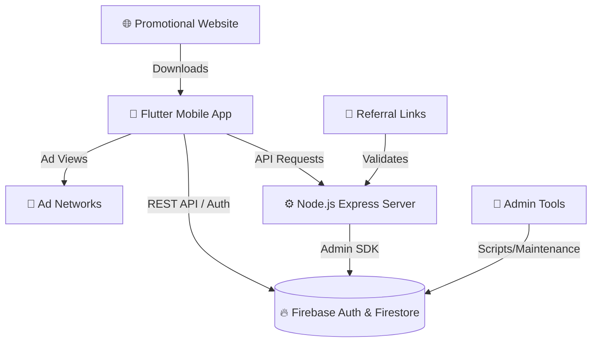

<div align="center">
  
  
  
  
  

  <h1>💎 FF Diamonds Ecosystem</h1>
  <p><strong>A complete ecosystem for earning, managing, and distributing Free Fire rewards.</strong></p>
</div>

<br />

## 📖 About The Project

The **FF Diamonds Ecosystem** is a comprehensive suite of applications designed to let users earn Free Fire diamonds by watching ads, participating in weekly competitions, and joining gaming leagues. 

This repository is a **Monorepo** that contains the entire infrastructure required to run the platform, from the user-facing mobile application and promotional websites to the secure backend server and administrative tooling.

---

## ✨ Key Features

### 📱 Mobile Application (`free_fire_app`)
- **Ad-to-Reward System**: Integrated with Google Mobile Ads, StartApp, and Unity Ads for token generation.
- **Diamond Exchange**: Secure conversion of earned tokens into in-game currency.
- **Competitions & Leagues**: Built-in leaderboards and weekly tournaments for bonus rewards.
- **Code Generator**: Daily generation of exclusive Free Fire reward codes.
- **Modern UI/UX**: Built with Flutter, featuring custom animations (`flutter_animate`), charts (`fl_chart`), and skeleton loaders (`shimmer`).

### 🌐 Web Interfaces (`all_web_ff_app`)
- **Promotional Site (`FF_app_web`)**: A high-conversion landing page optimized for downloading the app, complete with trust indicators and feature showcases.
- **Referral System (`get_rewards_link`)**: A dedicated interface handling user referrals and automated reward distribution via link tracking.

### ⚙️ Backend & Infrastructure (`FF_app_server` & `firebase-tools`)
- **Secure API**: Express.js server validating requests, handling secure token-to-diamond conversions, and preventing fraud.
- **Firebase Integration**: Deep integration with Firebase Auth, Firestore, and Cloud Messaging for real-time data sync and push notifications.
- **Admin Tooling**: Python and Node.js scripts for automated email dispatch and user verification auditing.

---

## 🏛️ Architecture Overview



---

## 📂 Repository Structure

```text
FF-app/
├── free_fire_app/          # 📱 Main Flutter Application (Android/iOS)
│   ├── lib/                # Dart source code
│   ├── android/            # Android native configuration
│   └── pubspec.yaml        # Flutter dependencies
├── FF_app_server/          # ⚙️ Node.js Backend API
│   ├── routes/             # Express API endpoints
│   ├── utils/              # Helper functions & middleware
│   └── index.js            # Server entry point
├── all_web_ff_app/         # 🌐 Static Web Interfaces
│   ├── FF_app_web/         # App landing and download page
│   └── get_rewards_link/   # Referral claim interface
└── firebase-tools/         # 🧰 Administrative Scripts
    ├── sendEmail.py        # Python email dispatcher
    └── listUnverifiedUsers.js # Node.js user auditing script
```

---

## 🚀 Getting Started

Follow these instructions to set up the different components of the ecosystem locally.

### 1. Mobile App (Flutter)
**Prerequisites**: [Flutter SDK](https://flutter.dev/docs/get-started/install) (v3.8.1+)
```bash
cd free_fire_app
# Install dependencies
flutter pub get
# Run the application on a connected device or emulator
flutter run
```

### 2. Backend Server (Node.js)
**Prerequisites**: [Node.js](https://nodejs.org/) (v18+)
```bash
cd FF_app_server
# Install dependencies
npm install
# Configure environment variables (Create a .env file based on .env.example)
# Start the server
npm start
```

### 3. Web Interfaces
The web components are built with vanilla HTML/CSS/JS. No build step is required.
- Use a local server like [Live Server](https://marketplace.visualstudio.com/items?itemName=ritwickdey.LiveServer) in VS Code.
- Navigate to `all_web_ff_app/FF_app_web/index.html` to view the landing page.

---

## 🔐 Environment & Security

This project requires sensitive credentials to run properly. **Never commit these files to version control.** A global `.gitignore` is already configured to protect them.

### Required Secret Files:
| Component | File Needed | Description |
|-----------|-------------|-------------|
| **Server** | `FF_app_server/.env` | Port configurations, API keys, and CORS settings. |
| **Server** | `FF_app_server/serviceAccountKey.json` | Firebase Admin SDK credentials for backend DB access. |
| **Tools** | `firebase-tools/serviceAccountKey.json` | Firebase credentials for admin scripts. |
| **App** | `free_fire_app/android/key.properties` | Keystore properties for Android production builds. |

> **Warning**: If you accidentally commit a `serviceAccountKey.json` or `.env` file, immediately revoke the keys in your Firebase/Google Cloud Console.

---

## 🛠️ Technology Stack

- **Frontend**: Flutter, Dart, HTML5, CSS3, JavaScript
- **Backend**: Node.js, Express.js, Python (Tools)
- **Database & Auth**: Firebase Authentication, Cloud Firestore, Firebase Storage
- **Monetization**: Google Mobile Ads, Unity Ads, StartApp SDK
- **DevOps**: Git, npm, Flutter Pub

---

<div align="center">
  <p>Built with ❤️ for the Free Fire Gaming Community</p>
</div>
